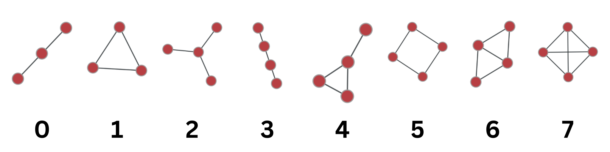

# BBM462 Social and Economic Networks - Homework 2

# Introduction:

The source repo can be found on [GitHub](https://github.com/calganaygun/networks-playground) 

The goal of this program is to perform analysis on two real-world networks to understand the prevalence of connected motifs with 3 or 4 nodes. The program uses the graph-tool library to count the motifs and generates random graphs with the same degree sequence as the original network for comparison.

I selected [bio-DM-LC](https://networkrepository.com/bio-DM-LC.php) biological network and [rt-twitter-copen](https://networkrepository.com/rt-twitter-copen.php) retweet network for work on. I wrote a program to load two datasets using `networkx.read_edgelist()` method. Then it prints the number of nodes and edges for each dataset. It also generates an ID for each graph using the sum of the number of nodes and edges (it is not safe approach, but we only have two networks and it is fast, anyways), which is later used as a prefix for the random graphs generated in Part A.

# Implementation:
```python
import networkx as nx

dataset_paths = ["bio-DM-LC/bio-DM-LC.edges", "rt-twitter-copen/rt-twitter-copen.mtx"]
datasets = []
for path in dataset_paths:
    G = nx.read_edgelist(path)
    print(f"Loaded {path} with {G.number_of_nodes()} nodes and {G.number_of_edges()} edges.")
    print(f"Graph ID for outputs: {G.number_of_nodes() + G.number_of_edges()}")
    datasets.append(G)
```
The output:
```
--------------------
Loaded bio-DM-LC/bio-DM-LC.edges with 658 nodes and 1129 edges.
Graph ID for outputs: 1787
--------------------
Loaded rt-twitter-copen/rt-twitter-copen.mtx with 761 nodes and 1029 edges.
Graph ID for outputs: 1790
--------------------
```

## Part A:

This part generates random graphs with the same degree sequence as the original graph. It calls the create_random_graph() function for each graph, which either loads the pre-generated random graph from disk if exists, or creates a new one and saves it for later use. This approach helped me a lot since random network generating 200 time takes some times. It uses the random_degree_sequence_graph() method of networkx to generate the random graphs. It takes a list of degree sequence of nodes as input and returns a random graph with the same degree sequence.

```python
import networkx as nx
import os

def create_random_graph(G, i):
    # calculate graph ID
    prefix = G.number_of_nodes() + G.number_of_edges()
    file_exist = os.path.exists(f"random_graphs/{prefix}/random_graph_{i}.edges")
    if file_exist:
        return nx.read_edgelist(f"random_graphs/{prefix}/random_graph_{i}.edges")
    # if not already generated generate new random graph
    degree_sequence = [G.degree(n) for n in G.nodes()]
    G_random = nx.random_degree_sequence_graph(degree_sequence, seed=i, tries=10)
    # save as file for using it late without waiting again
    nx.write_edgelist(G_random, f"random_graphs/{prefix}/random_graph_{i}.edges")
    print(f"Generated random graph {i} for {prefix}.")
```

## Part B:

This was the most challenging and research-intensive part. I counted the number of connected motifs with 3 or 4 nodes using the graph-tool library. I first tried to use the library called netsci, but I decided to use the graph-tool library because of both the documentation problem in netsci and the fact that it only gives 3-node motifs. It converts the networkx graph to a graph-tool graph to count the motifs. More details can be found on the [graph-tool documentation](https://graph-tool.skewed.de/static/doc/_modules/graph_tool/clustering.html#motifs) and [used c++ implementation of subgraph searching for motifs](https://github.com/antmd/graph-tool/blob/85f11ae869fe318532e60554963b16eca6367eab/src/graph/clustering/graph_motifs.cc#LL67C1-L156C1).


```python
import graph_tool.all as gt

def count_motifs(G):
    # copy netwok to graph tool
    g = gt.Graph(directed=False)
    node_map = g.new_vertex_property("int")
    for node in G.nodes():
        node_map[node] = g.add_vertex()
    for edge in G.edges():
        g.add_edge(node_map[edge[0]], node_map[edge[1]])

    # count 3-node and 4-node connected motifs using the k-core decomposition algorithm
    motifs_3 = gt.motifs(g, 3)
    motifs_4 = gt.motifs(g, 4)
    motifs_list = motifs_3[0] + motifs_4[0]
    motifs_counts = motifs_3[1] + motifs_4[1]
    return motifs_list, motifs_counts
# make sure always used same motif order
# save table
```

### Motifs:



### Output Tables:
`**bio-DM-LC**`
|Motifs:             |0      |1     |2       |3       |4      |5     |6     |7   |
|--------------------|-------|------|--------|--------|-------|------|------|----|
|Real Graph          |10336  |201   |88741   |29064   |3021   |9647  |1419  |13  |
|Random Graphs (Mean)|10500  |110   |86899   |75330   |6376   |449   |204   |6   |

`**rt-twitter-copen**`
|Motifs:             |0      |1     |2       |3       |4      |5     |6     |7   |
|--------------------|-------|------|--------|--------|-------|------|------|----|
|Real Graph          |6979   |149   |37569   |34618   |4294   |183   |179   |11  |
|Random Graphs (Mean)|7267   |53    |39859   |44103   |2298   |205   |52    |1   |

## Part C:

This part calculates the statistical significance of each connected motif with 3 or 4 nodes in each of the real-world networks by calculating its Z-score. It uses the results from Parts A and B to generate the random graphs and motifs counts for each random graph. It uses the mean and standard deviation of the counts of the motifs in the random graphs to calculate the Z-score of the counts of the motifs in the original graph. It returns a dictionary of Z-scores for each motif.

```python
def calculate_z_scores(motifs_counts_real, motifs_counts_randoms):
    z_scores = {}
    for i in range(len(motifs_counts_real)):
        random_motif_counts = [
            motifs_counts_random[i] for motifs_counts_random in motifs_counts_randoms
        ]
        real_motif_count = motifs_counts_real[i]
        mean_random = np.mean(random_motif_counts)
        std_random = np.std(random_motif_counts)
        z_score = (real_motif_count - mean_random) / std_random
        z_scores[i] = z_score
    return z_scores
# save table
```

This part plots the Z-score of each motif on a bar chart with the motifs on one axis and their significance scores on the other axis. It uses matplotlib to plot the chart and saves it as a PNG file.

### Output Graphs:
`**bio-DM-LC**`


`**rt-twitter-copen**`


# Conclusion:

This program analyzes the prevalence of connected motifs with 3 or 4 nodes in two real-world networks. It uses the graph-tool library to count the motifs and generates random graphs with the same degree sequence as the original graphs for comparison. It calculates the Z-score of the counts of each motif in the original graph by comparing them to the counts in the random graphs. It presents the results with a bar chart showing the Z-score of each motif.